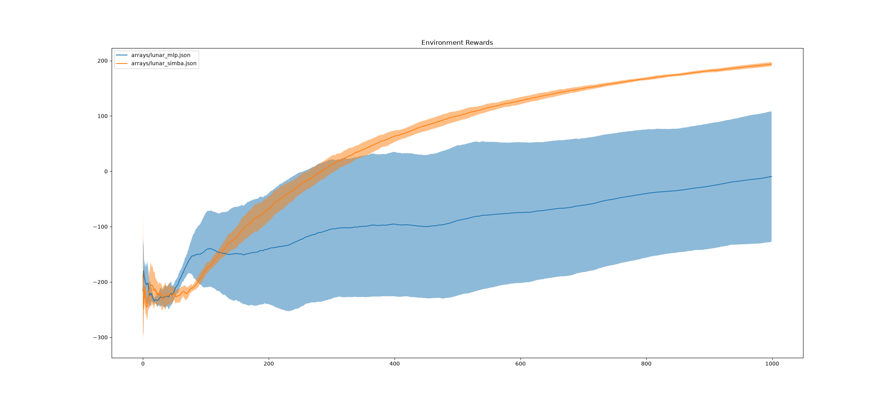
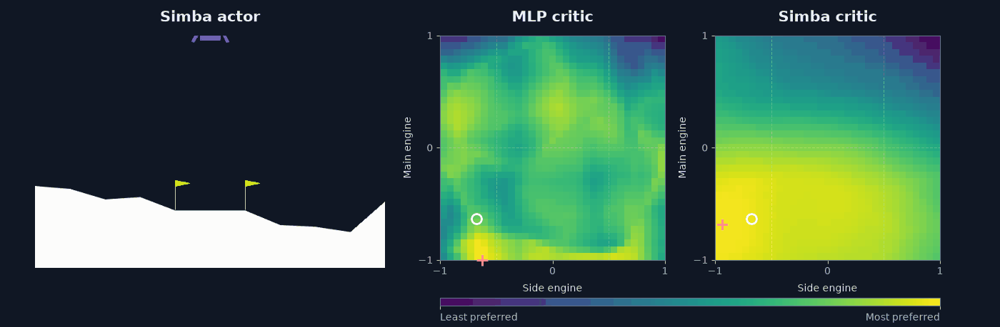

# LunarSimbaV2

An experiment comparing MLP and **SimbaV2**-style critics with Soft Actor-Critic (SAC) on continuous LunarLander. The critic architecture follows ideas from [Hyperspherical Normalization for Scalable Deep Reinforcement Learning](https://proceedings.mlr.press/v267/lee25u.html) (Lee et al., ICML 2025).

For applications like game AI, the policy needs to run on limited hardware, such as console CPUs or older PCs. The policy network therefore needs to be small and efficient. Since the critic is only needed during training, we can give it more capacity without increasing the cost of running the policy in-game. This experiment explores that motivation by changing the critic while keeping the actor architecture fixed. SimbaV2 is an architecture that promises to be good for high capacity networks, high UTD ratio (*so in theory it should be more sample efficient*) and/or high throughput in the data.

<p align="center">
  
</p>

This plot shows the result in LunarLander (my favourite RL environment!) and it is a comparison between a Simba-based critic vs an MLP-based critic. The two networks have (more or less) the same capacity (i.e. the same number of parameters). *This is with UTD=2*, to simulate the best setting for Simba. With proper tuning, the MLP one can achieve similar performance in similar time. 

<p align="center">
  
</p>

Both critics watch the same flight. Each map shows which engine commands the critic thinks are better (yellow) or worse (purple). The white circle is the action taken; the pink cross is the critic's favorite action. Watch where the yellow areas move as the lander descends: this shows where MLP and Simba agree or disagree about what to do. This GIF was created by Codex, it kinda of make sense although is pretty hard to understand. But basically, you can see that the MLP critic is all over the place, and in some states the two critics have very different shapes, and in general the Simba one is much better than the MLP one. **I repeat, this is not the best MLP critic that I found, but it is the MLP critic trained on the ideal settings for Simba**.

## What changes between the agents?

Both agents use the same Gaussian actor: five hidden layers of 512 units with ReLU activations, followed by mean and log-standard-deviation heads and tanh-squashed actions. The environment supplies eight observation values and two continuous actions.

| Component | MLP baseline | SimbaV2-style variant |
| --- | --- | --- |
| Critic embedding, per Q-network | Input layer plus seven hidden layers, width 768 | Width 512, two residual encoding blocks with 4× expansion |
| Normalization | No running observation normalization | Running observation statistics, unit-normalized features, and weight projection |
| Value output | Scalar Q-value | Categorical distribution over 101 atoms in `[-5, 5]` |
| Reward scaling | Raw rewards | Scaling from running discounted-return statistics |

This is a critic-focused adaptation: the actor remains an MLP. Use `--with-simba` and `--distributional-critic` together. In the current implementation, the distributional flag also enables Simba-specific observation updates and weight projection; it is not an independent switch for a distributional MLP baseline.

## Setup

Use Python 3.13 or newer and [uv](https://docs.astral.sh/uv/). From the repository root:

```bash
uv sync --locked
```

## Run the experiment

### 1. Train the two variants

MLP critic:

```bash
uv run main_rl.py --model-name lunar_mlp --total-episodes 1000
```

SimbaV2-style critic with distributional values:

```bash
uv run main_rl.py --model-name lunar_simba --total-episodes 1000 \
  --with-simba --distributional-critic
```


The main defaults are:

| Setting | Default |
| --- | --- |
| Environment | `LunarLanderContinuous-v3` |
| Episode limit | 1,000 steps |
| Training episode target | 10,000 |
| Initial random actions | 5,000 steps |
| Replay capacity / batch size | 1,000,000 / 256 |
| Gradient iterations per environment step after warm-up | 2 |
| Actor and critic learning rates | `1e-4`, decaying to `5e-5` over 2,000,000 scheduler steps |
| Discount / target update coefficient | `0.99` / `0.005` |
| Logging / saving interval | 100 / 1,000 episodes |

Use `--max-timesteps`, `--logging`, and `--save-frequency` to change the corresponding intervals. Distribution support is controlled by `--g-min`, `--g-max`, and `--number-of-atoms`. Other training settings live in [main_rl.py](main_rl.py); network sizes live in [architectures/](architectures/).

### 2. Plot training histories

After training agents, you can visualize the training curves (the script is a bit broken but you can get what you have in hte banner): 

```bash
uv run plot_results.py --runs 'lunar_mlp-1,lunar_simba-1' \
  --folder arrays --moving-average 100
```

If you want multiple runs for the same experiment, call them with -[number] so that the script will aggregate them together, and plot mean and std (like the image in the banner). 

## Evaluation 

You can run the trained agent with 

```bash
uv run main_rl.py --model-name lunar_simba --evaluate
```

Of course you need the already trained model. The script will run the trained policy (I think you have to press [y] to actually load the model when the script will ask you) and you will see the agent running in the environment with the rendered environment.

Released under the [MIT License](LICENSE).

--------------------------------------------------------------------------------------------------------------------------

This README was written with assistance from Codex, and corrected by the author. The code is entirely wrriten by the author with no AI assistance.
